[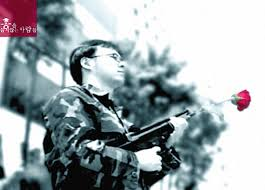](#)
# What is the next VHS?

### Table of Contents
1. [Artefact](#Artefact)
    1. [Metadata](#Metadata)
2. [Research](#Research)
    1. [The Broken VHS](#The-broken-vhs)
    2. [What Is Inside of VHS](#What-is-inside-of-vhs)
    3. [The Documentary](#The-documentary)

3. [Transcoding](#Transcoding)
    1. [Original Subtitle](#Original-subtitle)
    2. [Translated Version of Script](#Translated-version-of-script)
    3. [Non-linear Game](#Non-linear-Game)
    4. [What is next after VHS](#What-is-next-after-vhs)
4. [Reflection](#Reflection)
5. [Outcome](#Outcome)
6. [Conclusion](#Conclusion)
7. [Bibliography](#Bibliography)

# Artefact
A VHS contained a documentary film titled '총을 들지 않는 사람들' which is made in 2003. The author is Kim Hwantae.
The documentary's language is Korean.

## Metadata
| Tag | Data |  
|--|--|
**IISG Call Number** | [IISG BG V7/822](images/originalvideo.png)
| **Physical Description** | An earlier version of 'People who don't take up arms', 2004
| **Type** | Object
| **Medium** | Documentary
| **Materials** | VHS
| **Date** | (2002?)
|| One Scene from the documentary : A man protesting against Korean Military System hold a fake gun which a rose is put on the muzzle of the gun.

# Research
What I got impressed by is the VHS file itself was broken so I cannot access the content.
This small event leaded me to explore the small transcoding journey.

## The Broken VHS

At first, I and people from IISG tried other video readers as it might be an issue from the reader. But after using 3 different machines, we concluded that the VHS got broken. What I got noticed from a specialist in ISSG is that there are multiple reasons to make VHS broken. Luckily, the reader could show some memory in the VHS, so the VHS might be fixed if I bring it in a restore place. Unfortunately, due to Covid 19, all the places started to be closed, I couldn't contact them. So I started researching by myself.

### The State of Original Resource

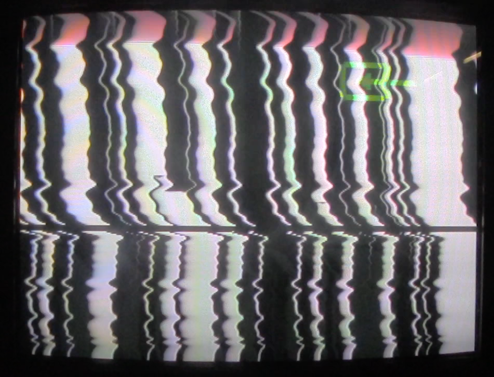

From the beginning to around 15min, there were black and white lines going around, but still formulating a specific visual with a sound-like noise.

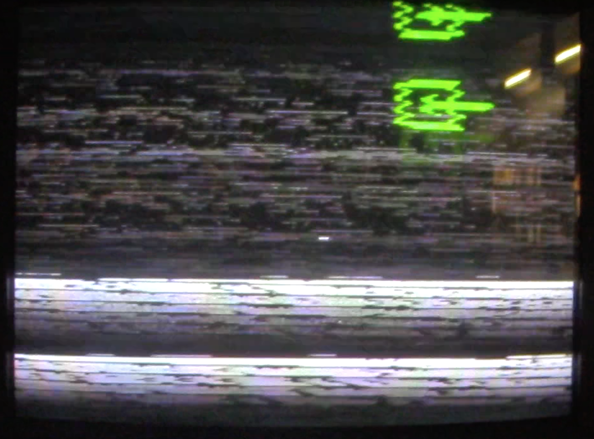

After around 15 min, there were only black and white lines going around with constant noise till the end.

### How VHS Works

[images/vhs.m4v](images/vhs.m4v)

Anatomy of VHS -1

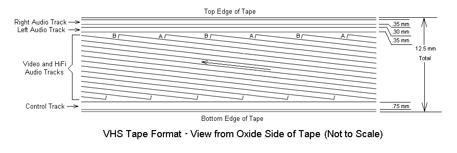

Anatomy of VHS - 2

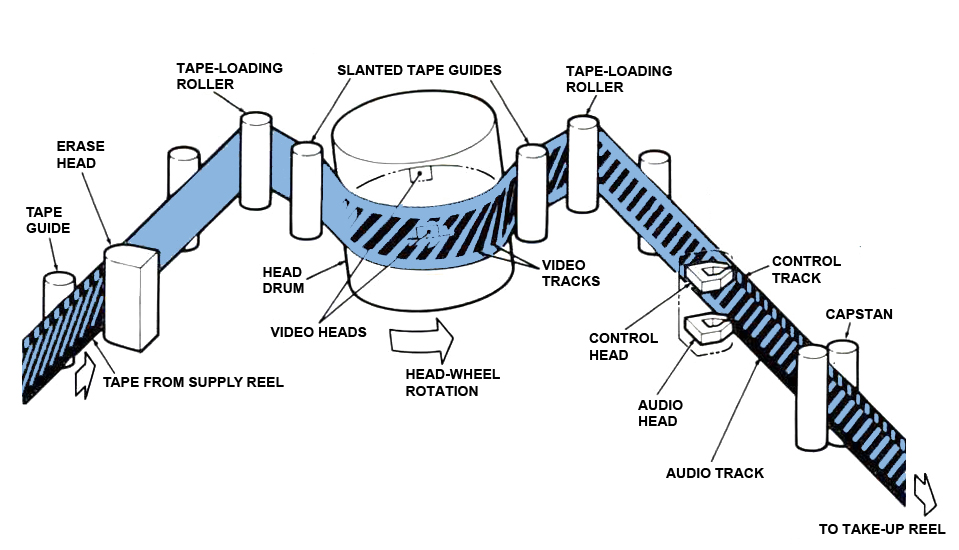

### What could be the reason to make VHS broken?

**Video Tape Decay & VHS Tape Problems**

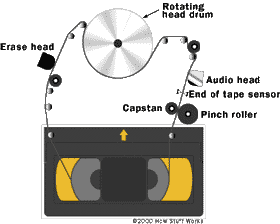

VHS, VHS-C, SVHS, Hi 8, Digital 8, and even DV all share one thing in common: they are magnetic media. And the trouble with magnetic charge ("remanence") is that it is fundamentally impermanent. But that's just the beginning of the trouble for videotape, for there is a long list of ways it can deteriorate:

- **Magnetic particles gradually lose their charge**, in a process called remanence decay. The rate depends somewhat on the exact chemistry of the particles used in the tape, but in general if this happens, you can expect some color shift toward weaker hues and loss of detail overall.
- **Magnetic particles may be accidentally demagnetized.** This can be from storing too near a magnetic source (like an audio loudspeaker) or even from the playback machine itself, whose heads can be become partically demagnetized if not maintained perfectly. With a poorly maintained VCR, every playback actually erases information from the tape!
- **The lubricant in the binder layer is used up**, with each playback. As it erodes, the binder layer itself takes on more wear, which can directly affect the magnetic particles and cause information loss.
- **The binder layer can become a sticky, unplayable mess.** The binder's polymers will absorb water (in even a moderately humid environment), in a process known as hydrolysis, and eventually delaminate. Engineers often refer to this as *sticky-shed syndrome.* Trying to play an affected VHS, VHS-C, or other magnetic tape is an invitation to damage of both the tape and the playback machine.
- **The backing and substrate can become stretched,** from multiple rewindings and playback. This causes tracking errors that can dramatically reduce playback quality.
- **Successive recordings can lose information and synch signals.** As an analog medium, each generation of recording loses substantial information. If the tape you are trying to preserve was in fact a 2nd or 3rd generation copy, it has already irretrievably lost a great deal of information (see this [light-hearted VHS example](http://cinemassacre.com/2010/05/26/vhs-generation-loss/) of what is of course a serious problem).

**Generation Loss**

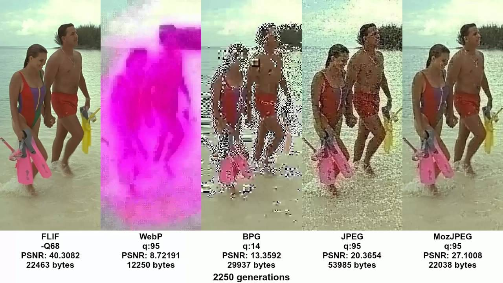

Generation loss is the loss of quality between subsequent copies or transcodes of data. Anything that reduces the quality of the representation when copying, and would cause a further reduction in quality on making a copy of the copy, can be considered a form of generation loss. File size increases are a common result of generation loss, as the introduction of artefacts may actually increase the entropy of the data through each generation.

(Example Link)

[https://www.youtube.com/watch?v=G8GOcB6H0uQ&t=43s](https://www.youtube.com/watch?v=G8GOcB6H0uQ&t=43s)

## What Is Inside of VHS

I should have tried to find a way to get source inside. There was no other way to get the content from online when I looked for. The only two ways how I could access this documentary were either **Visiting the Korean Film Archive** in Seoul or **Contacting the Director** of this film.

### Contact with Director 'Kim Taehwan' via mail

**What I asked him**

1. How to archive his works which have been created from a long time ago. Does he try to transcode all his materials following the latest version?
2. How does he take 'script' which is an analogue way? Does he think 'script' as a very important way of archiving?
3. What is the ultimate archiving way the director thinks?

**His Answer**

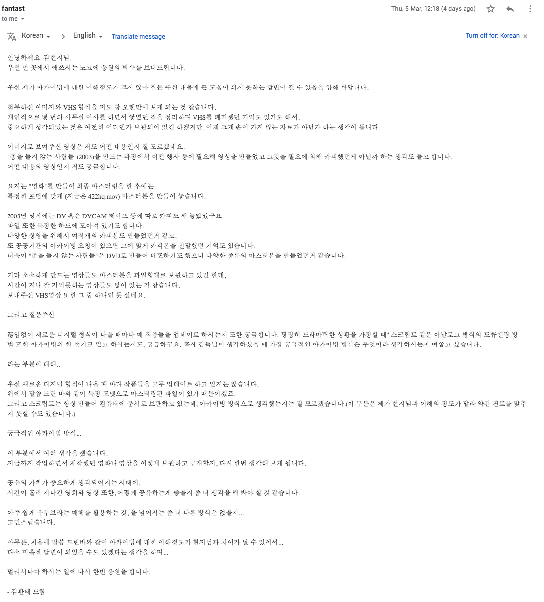

### 2-2. Contact with Korean Film Archive via mail

My first plan was asking one of my friend to go that archive and watch the film, and give me some notes that she watched. However, Outbreak of Covid 19 in Korea, the archive was closed.

I mailed the Archive to find a way to get the video file and asked if there is any way to access through online, and what they said was "they bought one DVD file from the director, but they didn't buy the copyright. Thus they cannot offer the film online".

Luckily, the working from archive personally sent me a mail that he found one link from online, which is not legal site. He asked me just watch it but not copy or download it.

## The Documentary

### Synopsis

Mainly focused on Oh Tae Yang who is going to be in jail for 2 years as he is an military service objector, HwanTae Kim filmed people around him and showed how they would think about objectors.

### Characters

Oh Tae Yang (Objector) - The Main Character of this animation

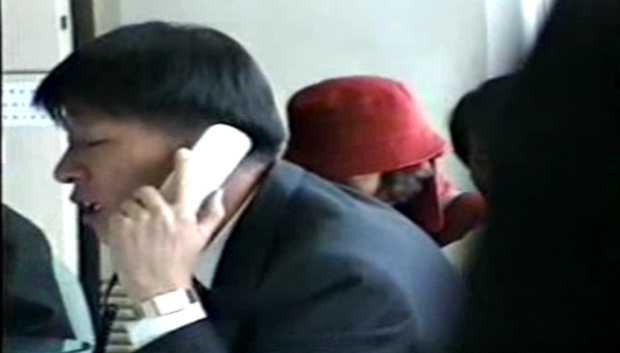

Military Manpower Administration Officer - Who thinks the objection is just an objection (He believes there is no other meaning it can have)

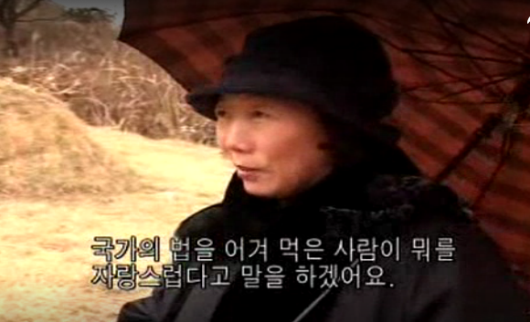

Oh's Mother - Who doesn't want him to go to jail, but cannot do anything.

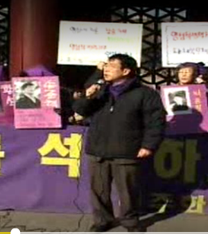

 A Catholic Priest - Who supports Objectors

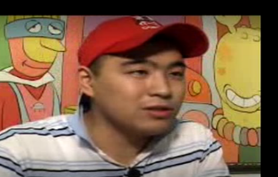

A Member of Youth Right-Wing Party - He thinks the objectors are villains in the Korean society.

A Member of Peace Union Organisation - He has the opposite mind of guy who is in Right Wing Party.

 Member of Korea Veterans Association - He believes the army should be kept for keeping Peace

A Professor in Law - He believes the objectors should be in jail

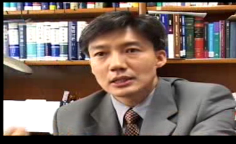

Another Professor in Law - He supports the objector's belief.

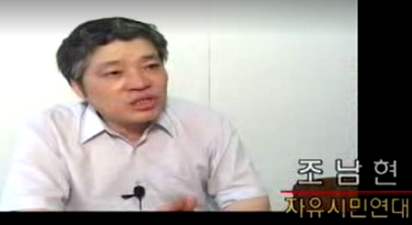

A Member of Freedom Alliance - He thinks the objectors should be in the jail as it is their choice and their responsibility

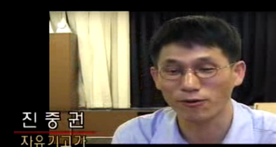

A South Korean Critic - He believes the society towards Objectors behaves cruel

Another Objector - He was in jail almost for 5 years. He couldn't have any dream about outside of jail after being in there for 1 and half years.

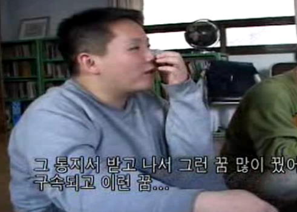

Pre-Objector: As a gay, he even cannot serve the military service since the society believes being queer is 'disease'.

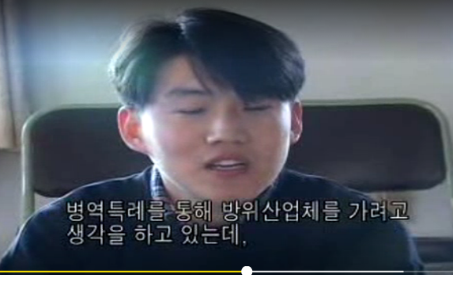

 Pre-Objector : A member of protest organisation of Korea Unity

A Supporter of KSCO: She believes, for gender equality, it should be realised disappearing of Conscription in Korea

Another Supporter of KSCO : She believes, for gender equality, it should be realised disappearing of Conscription in Korea

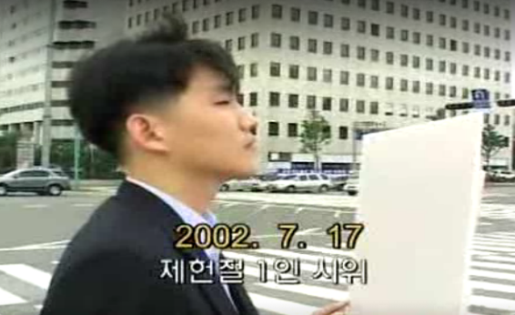

Another Objector : who protest on the day of Constitution Day

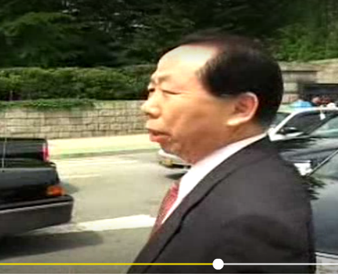

A Citizen : who start having a discussion with the Protestor

 A Russian-South Korean Columnist: He thinks the Public opinion has been manipulated to think North Korea is enemy and they need to keep their army for saving Country by the government

## Conclusion of the research

So, what would I still get from this? The original film is still being broken, people would not be possible to access it. And I could get one file online, but it is not a legal way to access it.

Then, what if I rephrase the content and transcode the story in another format?
And, also, what if I try to find a replacement of VHS format?

# Transcoding
My main transcoding is divided into two parts.
Content-wise and Container-wise.

For the content-part, what I focus on is "How would I like to rephrase the original content?"
For the container-part, What I focus on is  "What could be the replacement of VHS?"

## Original Subtitle
### Description
What I got impressed by a mail from Hwantae Kim was he does have a script but he never thought of its importance.
Script could be the last option among multiple stored digital materials. What if his videos would not be read in any machine,
and all the digital memories are gone? Then, the last memory of his artwork would be a written script. And at least, it could be
a documentation. The documentary even don't have any subtitles, only depending on the visual and audio. So I creating a written form of the documentary at this first round.
### Methods
Followed the film, I wrote every sentence from the film. The quality of documentary was super low. Sound system was quite bad.
The only one method to write them down was just listening and writing over and over again.
    <width="50%">

After this practice, I used 'Notepad', and made .srt file which is a format of subtitle. At this round, again, I tried to make a
sync one sec by one sec.

### Tools
Notepad

### Results

## Translated Version of Script
### Description
With the subtitle, there should be a script which is written, as I thought it could be one of the last option for archiving.
The original material that I started this project is being kept in Amsterdam which the first language is not Korean. To let people access it, this time, I created one translated version of script.  
### Methods
Firstly, I started re-construct the original scipt that I've already made. This time, I made a constitution of 5 plots.
And then, with the re-constructed one, I translated them into English.

### Results
[Translated version of Script.docx file](translation.docx)

## Non-linear Game
### Description
From the content, the most impressive part was the conversation/ discussion/ dialogue/ interview of different people.
I thought this is the core part of the film. The film doesn't talk about one side. It doesn't support neither objector, nor opponent.
The story of the content is full of circle of diverse thoughts. How could I transcode this content well? What could be the most make-sense format for this? I got an idea from a simulation game. There is a type of simulation game which is a player choose an option, and the result is going to be different by the choice. The documentary let audience think which position I support. The goal of this documentary has a connection to the way how simulation game works. Thus, I decided to create a web-game based on the plot of the documentary.

### Methods
  

Using HTML, I created one non-linear narrative web game.

### Tools
HTML
### Results
It's still on going.

## What is next after VHS
### Description
To answer the question 'What could be a replacement of VHS', I chose two points which should definitely be considered. Firstly, The format should be practical. It should be accessible towards majority of people who would like to utilise. VHS is already 'dead' format, majority cannot access it as it is not a common format to get video file in it anymore. Likewise, the replacement of VHS should be very accessible towards people. And secondly, the content should be protected well. The original content is an art piece. The work should not be distributed easily as it has an artistic value. Thus, what I chose as the container of all the transcoded contents is 'QR code'.

### Methods
Using a site helping to create QR code, create multiple QR codes containing all the transcoded materials.
### Results

### Source Links
QR code Maker

# Reflection

# Outcomes

### Outcome Links

# Conclusion

## Bibliography

<a name="footnote-1">**[1]**</a>: Look at this little referenced footnote over here. You can look up different text formats for referencing books, online articles, films etc.
